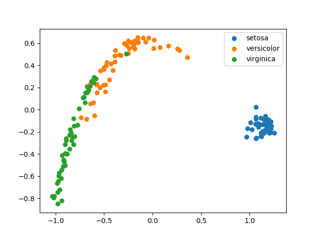
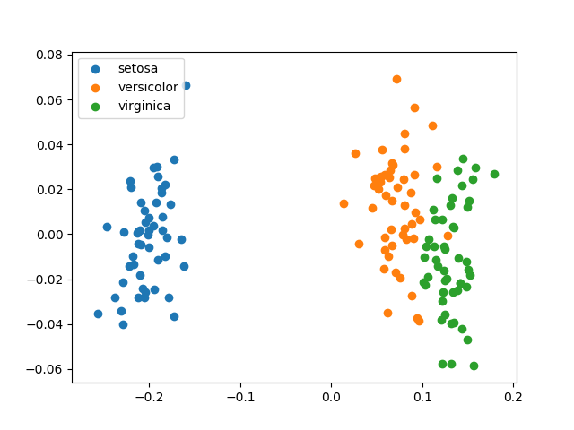

# mds_python
Implementing deterministic MDS (Multi Dimensional Scaling) in Python.

# Requirement

## for all
- numpy

## for demo
- matplotlib
- scikit-learn

# How to use
```python
    from mds import MDS
    import numpy as np

    mds = MDS()
    x = np.array([
        [0, 4, 8],
        [1, 5, 9],
        [2, 6, 0],
        [3, 7, 1],
    ])
    z = mds.fit_transform(x)
    print(z)
    # array([
    #   [-1.33993844, -0.50090235],
    #   [-1.43485236,  0.46776821],
    #   [ 1.43485236, -0.46776821],
    #   [ 1.33993844,  0.50090235]
    # ])
```

# Theoritical BackGround
MDS transforms the given matrix `X` into a low-dimensional 
matrix `Z` based on the distance between each element.

The distances between the elements are stored in the dissimilarity 
matrix `D`.

## Dissimilarity

In this class `MDS`, the following methods can be used to calculate 
dissimilarity.

### euclidean


### cosine


### precomputed
In this mode, any dissimilarity matrix `D` can be used.

To do so, pass the dissimilarity matrix `D` obtained by any method 
as the argument `X` of function `fit` or `fit_transform`.

## Calculation
Suppose that the kernel matrix `K`, which can be represented as 


using transformed matrix `Z`, can be obtained from the dissimilarity 
matrix `D`.

`K` is expressed using `D` as


where `H` is the centralization matrix and is defined as 


`I_n` is an identity matrix of size `n`, and `J_n` is a square matrix 
of size `n` and all elements are `1`.

Finally, `K` is eigen-decomposed as 


where `L` is a matrix with K's eigenvalues in its diagonal elements, 
and `V` is a matrix consisting of eigenvectors.

Therefore, `Z` can be calculated as 


where `sqrt(A)` represents the operation of taking the square root for all 
the elements of the matrix `A`.

If `L` and `V` are taken to contain only the top `k` eigenvalues/vectors, 
the dimension of `Z` can be reduced to `k`.

# Examples
In the demo in the source code, MDS is applied to the `iris` dataset.

## euclidean


## cosine
